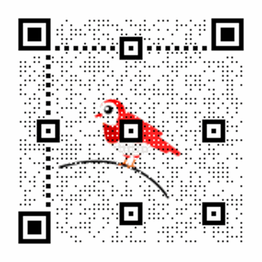
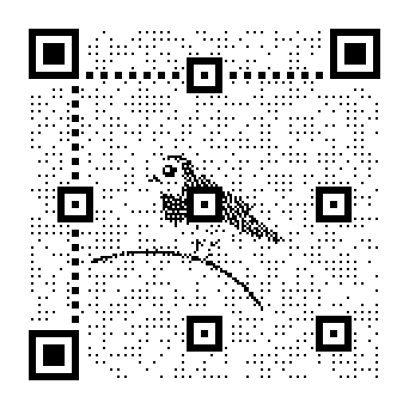

# Generador de Código QR con Amazing-QR


## Descripción del Proyecto

Este proyecto es un **Generador de Código QR** interactivo desarrollado con [Streamlit](https://streamlit.io/) y la biblioteca [Amazing-QR](https://github.com/x-hw/amazing-qr/tree/master). Permite a los usuarios generar códigos QR personalizados que pueden incluir imágenes o GIFs de fondo. La interfaz es intuitiva y accesible, facilitando la creación de códigos QR para cualquier enlace web.


## Instalación

1. **intala los requerimientos:**
   ```bash
   pip install -r requirements.txt
   ```


2. **Instala las dependencias:**

   Asegúrate de tener Python instalado. Luego, instala las librerías necesarias utilizando pip:

   ```bash
   pip install streamlit requests amzqr
   ```

## Uso

1. **Ejecuta la aplicación:**

   En la terminal, navega al directorio del proyecto y ejecuta:

   ```bash
   streamlit run app.py
   ```

2. **Genera tu código QR:**

   - Introduce el enlace al que deseas dirigir el código QR.
   - Carga una imagen o GIF de fondo (opcional).
   - Ajusta el contraste y brillo según tus preferencias.
   - Haz clic en "Generar" para crear tu código QR.
   - Descarga tu código QR generado haciendo clic en el botón de descarga.

## Ejemplos

¡Mira estos ejemplos de códigos QR generados!

| Ejemplo 1 | Ejemplo 2 | Ejemplo 3 | Ejemplo 4 | Ejemplo 5 |
|-----------|-----------|-----------|-----------|-----------|
|  |  |  |  |  |

## Características

- **Personalización:** Permite cargar imágenes o GIFs como fondo del código QR.
- **Ajustes Visuales:** Modifica el contraste y brillo del código QR.
- **Interfaz Intuitiva:** Diseño sencillo para facilitar la experiencia del usuario.
- **Ejemplos Visuales:** Presenta ejemplos de códigos QR generados para inspirar a los usuarios.


### Notas Importantes

- Asegúrate de tener una conexión a internet para cargar las imágenes desde URLs.
- Al usar imágenes o GIFs, verifica que sean accesibles y estén en los formatos soportados (JPG, PNG, GIF).


### Agradecimientos

Gracias a la comunidad de Streamlit y a los desarrolladores de Amazing-QR por sus valiosas herramientas que hacen este proyecto posible.

---

Asegúrate de que los enlaces a las imágenes en la sección de ejemplos sean correctos y que las imágenes estén en la ubicación adecuada en tu repositorio. Si necesitas más ajustes o personalizaciones, ¡házmelo saber!